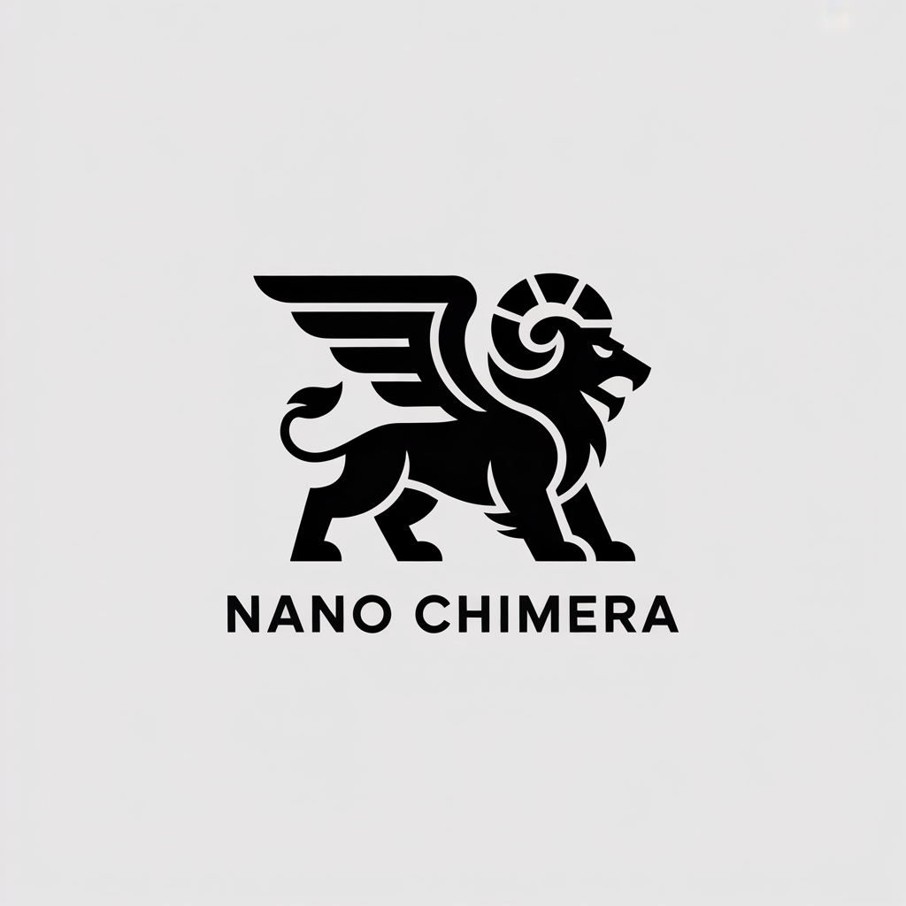

# Size does not matter: Sub-Billion VLM NanoChimera is All You Need!

<h1 align="center">

</h1>

## Description

This project addresses the modern challenge of Vision-Language Model (VLM) deployment by testing the scalability hypothesis: **Is massive parameter count necessary for effective visual reasoning?**

We construct and train **NanoChimera VLM**, a novel modular architecture designed to achieve high performance while strictly remaining **Sub-Billion** parameters ($\approx 999.99 \text{ Million}$ total deployed). Our goal is threefold: to provide a practical tutorial on building custom VLM architectures by training the critical Projector Layer, to rigorously evaluate its cognitive capabilities (grounding and hallucination), and to serve as a proof-of-concept for **real-time, edge-friendly multimodal AI**.

We validate the modular, two-stage training paradigm by focusing on three functional components:

| Role | Component | Description | Technical Status |
| :--- | :--- | :--- | :--- |
| **Vision Backbone (The Retina)** | **SigLIP-SO400M** | Extracts robust visual features (image embeddings) from the input image. | Frozen |
| **Language Backbone (The Cortex)** | **Qwen-0.5B-Instruct** | Handles reasoning, prompt following, and auto-regressive text generation. | Frozen |
| **Projector Bridge (The Synapse)** | **K-Layer MLP ($\approx 99.99 \text{M}$ params)** | Maps the high-dimensional visual input from the Retina into the language space of the Cortex. | Trained From Scratch|

## Contents

The directory is structured in the following way:

- **src**: Contains the core Python modules for the VLM architecture, training, and evaluation scripts.
- **resources**: Contains training data subsets (e.g., LLaVA-Instruct samples), pre-trained weights for the Projector, and presentation assets.
- **papers**: Essential academic papers (LLaVA, SigLIP, POPE) that form the theoretical foundation of the project.
- **webcam_assets**: Images and videos captured during the real-time webcam evaluation.

## TODO: Project Roadmap

Our current roadmap follows a strict **7-day timeline**, focusing on the construction, training, and real-time evaluation of the **NanoChimera VLM**. 

| Phase | Implementation Tasks |
| :--- | :--- |
| **1. Architecture** | 1. Implement and test the **Projector Module** (48,828 Intermediate Dimension). 2. Implement and test the `NanoChimeraVLM` class for end-to-end PyTorch/HuggingFace flow. |
| **2. Preprocessing** | 1. Curate a small, high-quality subset of LLaVA-Instruction (5k-10k pairs). 2. Implement the `NanoChimeraDataset` for LLaVA-style prompt formatting. |
| **3. Training** | 1. Implement `train.py` using Hugging Face Trainer. 2. **Execute Stage 1 Training:** Train only the $99.99 \text{ Million}$ Projector parameters. |
| **4. Evaluation & Comparison** | 1. Implement the **10-Object Micro-Benchmark** to compare NanoChimera against other small VLMs (e.g., Moondream 2). 2. Develop the **Streamlit Web Interface** for real-time webcam interaction. |

## SURVEY

The project draws inspiration from recent advances in modular and efficient Vision-Language Models. Our work is a proof-of-concept synthesis of the following architectural branches:

### 1) Modular Projection Architectures (The LLaVA Family)

* [**LLaVA (2023)**](https://arxiv.org/abs/2304.08487): Established the paradigm of freezing VLM backbones and using a trainable MLP/Linear layer for instruction tuning.
* [**LLaVA 1.5 (2023)**](https://arxiv.org/abs/2310.03744): Validates the use of a more complex **Multi-Layer Perceptron (MLP)** over a simple linear projection for improved grounding. (Justifies our $48,828$ intermediate dimension).
* [**Moondream 2 (2024)**](https://github.com/vikhyat/moondream): A highly efficient, small-scale VLM that proves the viability of tiny models for fast, local inference.

### 2) Efficient Vision Backbones

* [**SigLIP (2023)**](https://arxiv.org/abs/2303.15391): Used as our Vision Encoder. It demonstrates superior zero-shot performance compared to original CLIP for a given parameter budget by employing a **Sigmoid Loss** instead of the traditional softmax contrastive loss.

## Usage

### 0. Virtual Environment

> WARNING: It is highly recommended to create a virtual environment (e.g., using `venv` or `pyenv`) to ensure full reproducibility, using python 3.11.13 and the fixed requirements inside of `requirements.txt` file.

To create a virtual environment using `pyenv`:

```sh
# Install python 3.11.13
pyenv install 3.11.13
# Create the virtual environment
pyenv virtualenv 3.11.13 nanochim
# Activate it
pyenv activate nanochim
# Make it the default environment for this project
pyenv local nanochim 
# Install the dependencies using pip
pip install -r requirements.txts
```

### 1. Executing the Pipelines
In order to inspect and execute the different phases of the project, refer to the main scripts inside the src/ directory:

1) src/train.py: Executes the training loop for the Projector Bridge.

2) src/inference.py: Allows testing the trained NanoChimera VLM on a single image and text prompt.

3) webcam_eval.py: The final, interactive demonstration script for real-time cognitive evaluation.